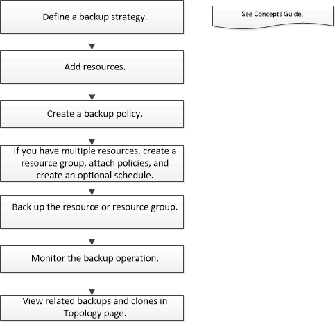

= Sauvegarder les ressources des plug-ins pris en charge par NetApp
:allow-uri-read: 
:icons: font
:imagesdir: ../media/

[role="lead"]
Le flux de travail de sauvegarde comprend la planification, l'identification des ressources pour la sauvegarde, la gestion des politiques de sauvegarde, la création de groupes de ressources et l'association de politiques, la création de sauvegardes et la surveillance des opérations.

Le flux de travail suivant montre la séquence dans laquelle vous devez effectuer l’opération de sauvegarde :

Vous pouvez également utiliser les applets de commande PowerShell manuellement ou dans des scripts pour effectuer des opérations de sauvegarde, de restauration et de clonage.  Pour obtenir des informations détaillées sur les applets de commande PowerShell, utilisez l'aide de l'applet de commande SnapCenter ou consultez le https://docs.netapp.com/us-en/snapcenter-cmdlets/index.html["Guide de référence de l'applet de commande du logiciel SnapCenter"]
