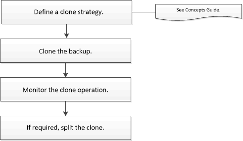

= Cloner les sauvegardes de ressources des plug-ins pris en charge par NetApp
:allow-uri-read: 
:icons: font
:imagesdir: ../media/

[role="lead"]
Le flux de travail de clonage comprend l’exécution de l’opération de clonage et la surveillance de l’opération.

.À propos de cette tâche
Vous pouvez cloner des sauvegardes de ressources pour les raisons suivantes :

* Pour tester les fonctionnalités qui doivent être implémentées à l'aide de la structure et du contenu des ressources actuelles pendant les cycles de développement des applications
* Pour les outils d'extraction et de manipulation de données lors du remplissage des entrepôts de données
* Pour récupérer des données supprimées ou modifiées par erreur

Le flux de travail suivant montre la séquence dans laquelle vous devez effectuer l'opération de clonage :

Vous pouvez également utiliser les applets de commande PowerShell manuellement ou dans des scripts pour effectuer des opérations de sauvegarde, de restauration et de clonage.  Pour obtenir des informations détaillées sur les applets de commande PowerShell, utilisez l'aide de l'applet de commande SnapCenter ou consultez le https://docs.netapp.com/us-en/snapcenter-cmdlets/index.html["Guide de référence de l'applet de commande du logiciel SnapCenter"^] .
