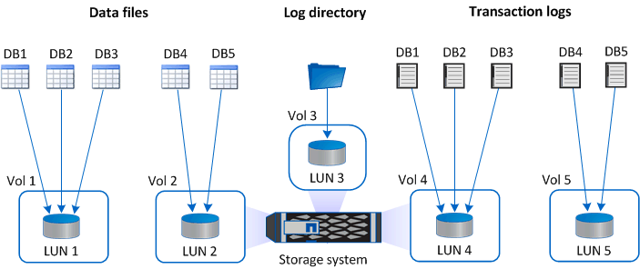

= Recommandations de disposition de stockage pour le plug-in SnapCenter pour Microsoft SQL Server
:allow-uri-read: 
:icons: font
:imagesdir: ../media/

[role="lead"]
Une disposition de stockage bien conçue permet à SnapCenter Server de sauvegarder vos bases de données pour répondre à vos objectifs de récupération.  Vous devez prendre en compte plusieurs facteurs lors de la définition de votre configuration de stockage, notamment la taille de la base de données, le taux de modification de la base de données et la fréquence à laquelle vous effectuez des sauvegardes.

Les sections suivantes définissent les recommandations et restrictions de disposition de stockage pour les LUN et les disques de machine virtuelle (VMDK) avec SnapCenter Plug-in pour Microsoft SQL Server installé dans votre environnement.

Dans ce cas, les LUN peuvent inclure des disques VMware RDM et des LUN iSCSI directement connectés qui sont mappés à l'invité.

== Exigences LUN et VMDK

Vous pouvez éventuellement utiliser des LUN dédiés ou des VMDK pour des performances et une gestion optimales pour les bases de données suivantes :

* Bases de données maîtres et modèles
* Tempdb
* Fichiers de base de données utilisateur (.mdf et .ndf)
* Fichiers journaux de transactions de la base de données utilisateur (.ldf)
* Répertoire des journaux

Pour restaurer de grandes bases de données, la meilleure pratique consiste à utiliser des LUN ou des VMDK dédiés.  Le temps nécessaire pour restaurer un LUN ou un VMDK complet est inférieur au temps nécessaire pour restaurer les fichiers individuels stockés dans le LUN ou le VMDK.

Pour le répertoire journal, vous devez créer un LUN ou un VMDK distinct afin qu'il y ait suffisamment d'espace libre sur les disques de données ou de fichiers journaux.

== Exemples de dispositions LUN et VMDK

Le graphique suivant montre comment vous pouvez configurer la disposition du stockage pour les grandes bases de données sur les LUN :

image::../media/smsql_storage_layout_mult_vols_snapcenter.gif[Diagramme de plusieurs LUN]

Le graphique suivant montre comment vous pouvez configurer la disposition du stockage pour les bases de données moyennes ou petites sur les LUN :

Le graphique suivant montre comment vous pouvez configurer la disposition du stockage pour les grandes bases de données sur les VMDK :

image::../media/smsql_storage_layout_large_dbs_vmdk.gif[Disposition de stockage pour les grandes bases de données sur VMDK]

Le graphique suivant montre comment vous pouvez configurer la disposition du stockage pour les bases de données moyennes ou petites sur les VMDK :

image::../media/smsql_storage_layout_med_small_dbs_vmdk.gif[Disposition de stockage pour les bases de données moyennes ou petites sur VMDK]
