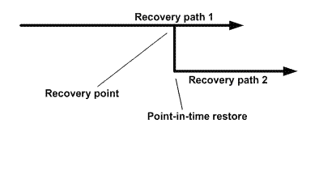

= Types d'opérations de restauration
:allow-uri-read: 
:icons: font
:imagesdir: ../media/

[role="lead"]
Vous pouvez utiliser SnapCenter pour effectuer différents types d’opérations de restauration sur les ressources SQL Server.

* Restaurer à la minute près
* Restaurer à un point antérieur dans le temps

Vous pouvez restaurer jusqu'à la minute près ou restaurer à un point antérieur dans les situations suivantes :

* Restaurer à partir du stockage secondaire SnapMirror ou SnapVault
* Restaurer vers un chemin alternatif (emplacement)

NOTE: SnapCenter ne prend pas en charge SnapRestore basé sur le volume.

== Restaurer à la minute près

Dans une opération de restauration à la minute près (sélectionnée par défaut), les bases de données sont récupérées jusqu'au point de défaillance.  SnapCenter accomplit cela en exécutant la séquence suivante :

. Sauvegarde le dernier journal de transactions actif avant de restaurer la base de données.
. Restaure les bases de données à partir de la sauvegarde complète de la base de données que vous sélectionnez.
. Applique tous les journaux de transactions qui n'ont pas été validés dans les bases de données (y compris les journaux de transactions des sauvegardes depuis le moment où la sauvegarde a été créée jusqu'au moment le plus récent).
+
Les journaux de transactions sont déplacés vers l’avant et appliqués à toutes les bases de données sélectionnées.

Une opération de restauration à la minute près nécessite un ensemble contigu de journaux de transactions.

Étant donné que SnapCenter ne peut pas restaurer les journaux de transactions de la base de données SQL Server à partir de fichiers de sauvegarde de journalisation (la journalisation vous permet d'envoyer automatiquement des sauvegardes de journaux de transactions d'une base de données principale sur une instance de serveur principale vers une ou plusieurs bases de données secondaires sur des instances de serveur secondaires distinctes), vous ne pouvez pas effectuer une opération de restauration à la minute près à partir des sauvegardes de journaux de transactions.  Pour cette raison, vous devez utiliser SnapCenter pour sauvegarder vos fichiers journaux de transactions de base de données SQL Server.

Si vous n'avez pas besoin de conserver une capacité de restauration à la minute près pour toutes les sauvegardes, vous pouvez configurer la conservation des sauvegardes du journal des transactions de votre système via les stratégies de sauvegarde.

== Exemple d'une opération de restauration à la minute près

Supposons que vous exécutiez la sauvegarde SQL Server tous les jours à midi et que le mercredi à 16h00, vous deviez effectuer une restauration à partir d'une sauvegarde.  Pour une raison quelconque, la sauvegarde du mercredi midi a échoué à la vérification, vous décidez donc de restaurer à partir de la sauvegarde du mardi midi.  Après cela, si la sauvegarde est restaurée, tous les journaux de transactions sont déplacés vers l'avant et appliqués aux bases de données restaurées, en commençant par ceux qui n'ont pas été validés lorsque vous avez créé la sauvegarde de mardi et en continuant jusqu'au dernier journal de transactions écrit le mercredi à 16h00 (si les journaux de transactions ont été sauvegardés).

== Restaurer à un point antérieur dans le temps

Dans une opération de restauration à un instant T, les bases de données sont restaurées uniquement à un moment précis du passé.  Une opération de restauration à un instant donné se produit dans les situations de restauration suivantes :

* La base de données est restaurée à un moment donné dans un journal de transactions sauvegardé.
* La base de données est restaurée et seul un sous-ensemble de journaux de transactions sauvegardés lui est appliqué.

NOTE: La restauration d’une base de données à un moment donné génère un nouveau chemin de récupération.

L'image suivante illustre les problèmes rencontrés lors d'une opération de restauration à un instant T :

Dans l’image, le chemin de récupération 1 se compose d’une sauvegarde complète suivie de plusieurs sauvegardes du journal des transactions.  Vous restaurez la base de données à un moment donné.  De nouvelles sauvegardes du journal des transactions sont créées après l’opération de restauration à un instant T, ce qui aboutit au chemin de récupération 2.  Les nouvelles sauvegardes du journal des transactions sont créées sans créer de nouvelle sauvegarde complète.  En raison d'une corruption des données ou d'autres problèmes, vous ne pouvez pas restaurer la base de données actuelle tant qu'une nouvelle sauvegarde complète n'est pas créée.  De plus, il n’est pas possible d’appliquer les journaux de transactions créés dans le chemin de récupération 2 à la sauvegarde complète appartenant au chemin de récupération 1.

Si vous appliquez des sauvegardes du journal des transactions, vous pouvez également spécifier une date et une heure particulières auxquelles vous souhaitez arrêter l'application des transactions sauvegardées.  Pour ce faire, vous spécifiez une date et une heure dans la plage disponible et SnapCenter supprime toutes les transactions qui n'ont pas été validées avant ce moment.  Vous pouvez utiliser cette méthode pour restaurer des bases de données à un moment donné avant qu'une corruption ne se produise, ou pour récupérer après une suppression accidentelle d'une base de données ou d'une table.

== Exemple d'une opération de restauration ponctuelle

Supposons que vous effectuiez des sauvegardes complètes de la base de données une fois à minuit et une sauvegarde du journal des transactions toutes les heures.  La base de données plante à 9h45, mais vous sauvegardez toujours les journaux de transactions de la base de données défaillante.  Vous pouvez choisir parmi ces scénarios de restauration ponctuelle :

* Restaurez la sauvegarde complète de la base de données effectuée à minuit et acceptez la perte des modifications de la base de données effectuées par la suite.  (Option : Aucune)
* Restaurer la sauvegarde complète de la base de données et appliquer toutes les sauvegardes du journal des transactions jusqu'à 9h45 (Option : Journaliser jusqu'à)
* Restaurez la sauvegarde complète de la base de données et appliquez les sauvegardes du journal des transactions, en spécifiant l'heure à laquelle vous souhaitez que les transactions soient restaurées à partir du dernier ensemble de sauvegardes du journal des transactions.  (Option : À une heure précise)

Dans ce cas, vous calculeriez la date et l’heure à laquelle une certaine erreur a été signalée.  Toutes les transactions qui n’ont pas été validées avant la date et l’heure spécifiées sont supprimées.
